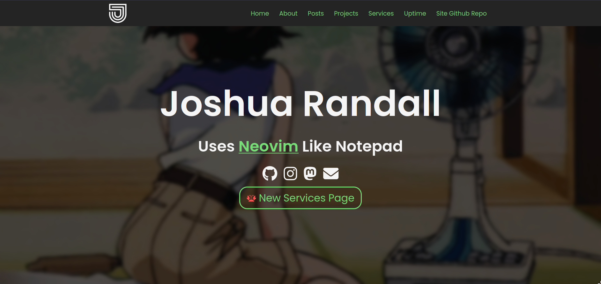

# The Actual README

I started working on this site while I was taking an HTML, CSS, and JS class. This was a way for me to practice what I was actively learning in class and out, and apply it to something practical and necessary to expand my portfolio and "brand". 



Using the site is very straight forward since the site uses a very simple design. Current feature set includes:
- [x] Parallax backgrounds for desktop
- [x] Mobile prioritized design
- [x] Clean but non intrusive CSS animations
- [x] Handling of post and project pages using Astro's built in routing
    - [x] Post and project pages are generated from markdown files

#### Attributions
- [Astro](https://astro.build)
- [This YouTube tutorial for HTML CSS and JS](https://youtu.be/FazgJVnrVuI).
    - The tutorial was used to make early template versions of this site which were never public (much thanks to [Brian Design](https://www.youtube.com/@briandesign)). After practicing with the tutorial, I used the template versions I created as a base for this site. The only things that is very reminiscent or the same, would be the hamburger menu bars to open the mobile menu + the top navigation bar, and the fonts may be similar since Google fonts were used. Everything else apart from those things mentioned was made from scratch.
- The many GIFs taken from Google images to create the awesome backgrounds for this site.
- Icons for the [about page](https://joshrandall.net/about) taken from Google images, some with necessary proper attribution visible on site.


<hr>

> Below is a template README from astro, which is there to help you out if you decide to fork this repo or run the site locally:

# Astro Starter Kit: Minimal

```
npm create astro@latest -- --template minimal
```

[](https://stackblitz.com/github/withastro/astro/tree/latest/examples/minimal)
[](https://codesandbox.io/p/sandbox/github/withastro/astro/tree/latest/examples/minimal)
[](https://codespaces.new/withastro/astro?devcontainer_path=.devcontainer/minimal/devcontainer.json)

> 🧑‍🚀 **Seasoned astronaut?** Delete this file. Have fun!

## 🚀 Project Structure

Inside of your Astro project, you'll see the following folders and files:

```
/
├── public/
├── src/
│   └── pages/
│       └── index.astro
└── package.json
```

Astro looks for `.astro` or `.md` files in the `src/pages/` directory. Each page is exposed as a route based on its file name.

There's nothing special about `src/components/`, but that's where we like to put any Astro/React/Vue/Svelte/Preact components.

Any static assets, like images, can be placed in the `public/` directory.

## 🧞 Commands

All commands are run from the root of the project, from a terminal:

| Command                   | Action                                           |
| :------------------------ | :----------------------------------------------- |
| `npm install`             | Installs dependencies                            |
| `npm run dev`             | Starts local dev server at `localhost:3000`      |
| `npm run build`           | Build your production site to `./dist/`          |
| `npm run preview`         | Preview your build locally, before deploying     |
| `npm run astro ...`       | Run CLI commands like `astro add`, `astro check` |
| `npm run astro -- --help` | Get help using the Astro CLI                     |

## 👀 Want to learn more?

Feel free to check [our documentation](https://docs.astro.build) or jump into our [Discord server](https://astro.build/chat).
